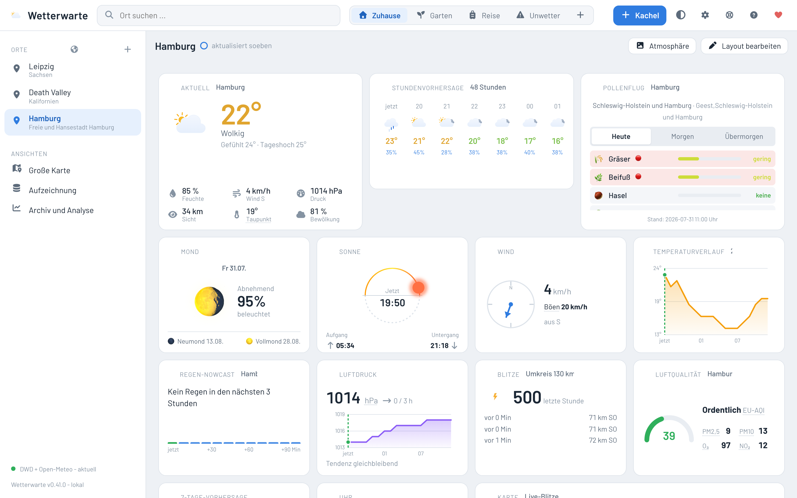

# Wetterwarte

Eine eigenständige, weitgehend unabhängige Wetter-App für den Browser (Desktop und Handy).
Kern ist eine komplett kachelbasierte Oberfläche: Kacheltypen werden per Drag-and-Drop frei
angeordnet und in der Größe gezogen. Außer den reinen Wetterdaten läuft alles lokal; eine
große PostgreSQL zeichnet ausgewählte Stationen und Orte langfristig auf.



## Funktionen

- **Kachel-Dashboard**: Widgets per Drag-and-Drop anordnen und in der Größe ziehen; mehrere
  benannte Layouts (Zuhause, Garten, Reise, Unwetter) zum Umschalten.
- **Viele Kacheltypen**: Aktuell, Stunden- und Tagesvorhersage, Pollenflug, Luftqualität,
  Sonne und Mond, Wind, Luftdruck, Blitze, Regen-Nowcast, Uhr und Kalender, Klima-Diagramm,
  echte Jahresmesswerte und mehr.
- **Große Karte**: Basiskarten (hell, dunkel, Satellit) mit umschaltbaren Ebenen - eigenes
  DWD-RADOLAN-Regenradar (gemessen plus Nowcast bis +2 h, wahlweise Live oder Animation),
  amtliche Warnungen, Temperatur-Farbfeld, Windpfeile und Live-Blitze.
- **Orte**: weltweite Ortssuche, Demo-Orte (Extremwetter und bekannte Orte) zum Ausprobieren,
  Reihenfolge per Drag-and-Drop.
- **Langzeit-Archiv**: ausgewählte Orte und Variablen werden in PostgreSQL aufgezeichnet;
  Archiv- und Analyse-Ansicht mit Klima-Normalen.
- **Deep-Links ohne Hash**: Ansicht und aktiver Ort stehen in der URL - Neuladen und Teilen
  behalten den Zustand.
- **Selbst gehostet und datensparsam**: kein Tracking, keine Werbung. Die einzige
  Außenanbindung sind die reinen Wetter-Rohdaten; das Backend holt sie getaktet und puffert
  sie, das Frontend liest nur den Zwischenpuffer. Karten, Schrift und Icons liegen lokal.
- **In-App-Hilfe**: durchsuchbares Schwebefenster mit Tiefenlinks, plus Rettungsring-Onboarding
  für Erstnutzer.

## Aufbau

```
backend/     FastAPI (SQLModel, asyncpg, Alembic) - API und Datenschicht
frontend/    Svelte 5 + Vite + TypeScript - kachelbasiertes Dashboard
mockups/     Durchklickbares HTML/CSS-Mockup (verbindliche Design-Vorlage)
tools/       setup-env.sh (projekt-eindeutige Ports und Namen via cksum)
docker-compose.yml   Postgres und Redis (nur als Container)
wetter       Einstiegspunkt für Einrichtung und Betrieb
```

## Entwicklung

Voraussetzungen: Docker, Node.js, uv (Python).

```bash
./wetter setup     # erzeugt .env mit eindeutigen Ports und Passwörtern
./wetter up        # startet Postgres und Redis als Container
```

Danach die Entwicklungsserver auf dem Host starten:

```bash
cd backend  && uv run uvicorn wetterwarte.main:app --reload --port <BACKEND_PORT>
cd frontend && npm install && npm run dev
```

Die Ports stehen in der erzeugten `.env` (Standardbereich ab 6150). Das Frontend spricht das
Backend same-origin über den Vite-Proxy an (kein CORS nötig).

## Design-Vorlage ansehen

Das durchklickbare Mockup ist der verbindliche Design-Leitfaden. Die App übernimmt dessen Optik
1:1. Ansehen:

```bash
./wetter mockup
```

Galerie: `http://localhost:6159/mockups/index.html`

## Datenquellen

Wetterdaten kommen von den offiziellen, freien Quellen (Deutscher Wetterdienst für Deutschland,
Open-Meteo weltweit) und werden lokal aufbereitet und gecacht. Kartenmaterial stammt aus
OpenStreetMap und wird lokal gehostet. Schrift (Barlow) und Icons werden lokal gebündelt, ohne
externe Netzwerkabrufe.

## Danke sagen

Die Wetterwarte ist ein privates Projekt - kein Tracking, keine Werbung, alles selbst gehostet.
Wenn sie dir gefällt, kannst du auf einen Kaffee einladen:

[Einen Kaffee spendieren (Ko-fi)](https://ko-fi.com/HalloWelt42)

Oder per Krypto:

- Bitcoin (BTC): `bc1qnd599khdkv3v3npmj9ufxzf6h4fzanny2acwqr`
- Dogecoin (DOGE): `DL7tuiYCqm3xQjMDXChdxeQxqUGMACn1ZV`
- Ethereum (ETH): `0x8A28fc47bFFFA03C8f685fa0836E2dBe1CA14F27`

## Lizenz

Nicht-kommerzielle Lizenz v1.0 - private, nicht-kommerzielle Nutzung und eigene Anpassungen sind
erlaubt, öffentliche Verbreitung veränderter Versionen nicht. Einzelheiten in [LICENSE](LICENSE).
